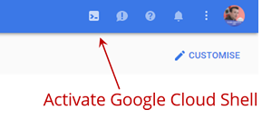
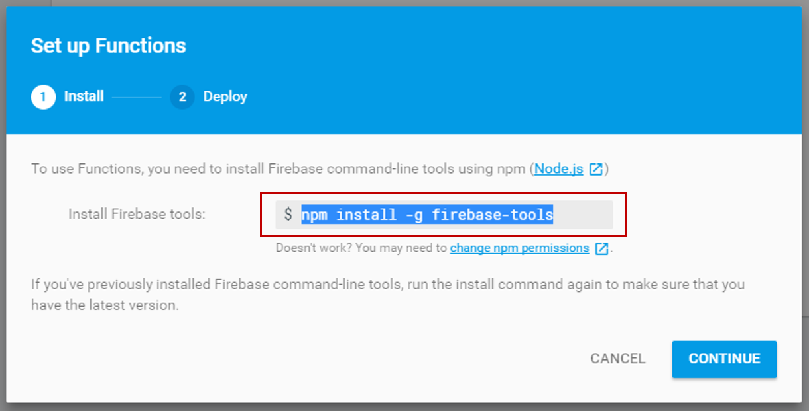
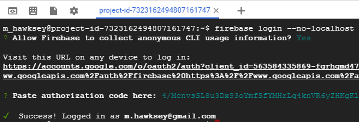
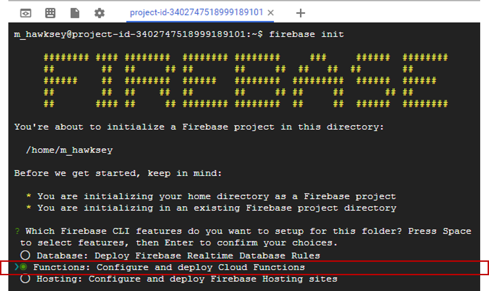

# Cloud-Functions-for-Firebase-in-Google-Apps-Script
*This tutorial was developed by **[Riël Noterman*s](https://developers.google.com/experts/people/ri-l-notermans)* and **[Martin Hawksey* ](https://developers.google.com/experts/people/martin-hawksey)*GDEs for Google Apps Script. This tutorial is based on a supporting video featuring Riël going through and explaining each of these steps  **[https://www.youtube.com/watch?v=yi5ktHjv_F*E](https://www.youtube.com/watch?v=yi5ktHjv_FE)* *

Google Apps Script is a powerful tool to integrate with Google products and third party services. As Apps Script is a free service which runs on Google servers there are quotas designed to prevent abuse of the service. These quotas can however sometimes prevent you from completing your project. In this tutorial we introduce Cloud Functions for Firebase as a solution for getting around some of the quota limits. In particular, we look at how you can get around issues when trying to fetch files greater than 10MB. In this tutorial we show how a Cloud Function can be used with Google Apps Script to fetch a large file, save it to your Google Drive and return a file id which can be used in the rest of your script project.

**Note:** In this tutorial we are using Cloud Functions for Firebase. Cloud Functions for Firebase  are essentially a wrapper around Google Cloud Functions, designed to make it easier to use and integrate these within your Firebase project and integrate with other Firebase services. If you are just using functions you might consider using Google Cloud Functions instead.

1. Start a new script project [https://script.google.com/](https://script.google.com/)

2. In the Script Editor open Resources > Cloud Platform project…

3. In the dialog that opens click on the link under the ‘This script is currently associated with project:’ prompt. 

4. In the Google Developer Console window that opens click on the menu icon in the top left () and then click the Google Cloud Platform link from the bottom of the menu.

5. In the Google Cloud Platform window that open click the Activate Google Cloud Shell 

6. Open the Firebase Console at [https://console.firebase.google.com/](https://console.firebase.google.com/) and create a new project.

7. In the new project click ‘Functions’ from the left side menu and then click ‘Get Started’.

8. In the window that opens copy the command npm install -g firebase-tools to the Google Cloud Shell window opened in step 5. (running this command also updates to the latest version)

9. It will take 1-2 minutes to install the Firebase tools and some errors may be thrown but these can be ignored for this tutorial. 

10. When it finishes still in the Google Cloud Shell window now type firebase login --no-localhost. If this is your first Firebase project you will need to follow the command prompts copy/pasting the authentication url into a new browser tab and once logged in and authenticated the authorisation code back into the Google Cloud Shell window. Once completed you should see a Success! Logged in as … message

11. In the shell make a project directory with mkdir cfdemo and then change directory cd cfdemo.

Cloud Shell gives you a 5GB home directory which persist across sessions. Here is [more information on Cloud Shell. ](https://cloud.google.com/shell/)

12. To initiate Cloud Functions in our project now enter the command firebase init and use your down cursor to Functions: Configure and deploy Cloud Functions and **press your spacebar to select before pressing enter**.  

13. You will now be prompt to select the Firebase project, at which point you can use your down cursor to select the project you created earlier.

14. You will be asked if you want to install dependencies with npm now? , select No.

15. At the top of the Google Cloud Shell window click on the Files menu to allow you to launch the code editor

16. In the code editor open the index.js file in the functions directory

17. Copy and paste the code below to replace the contents of index.js <[INSERT CODE](https://github.com/mhawksey/Cloud-Functions-for-Firebase-in-Google-Apps-Script/blob/master/src/index.js)>

18. The code includes a number of required libraries. To include these hover/click over the  icons and select ‘Update package.json’. 

19. Back in the Cloud Shell change directory to functions with cd functions

20. To install the required modules enter the command npm install

21. Now run npm install firebase-functions --save

22. To deploy our function firebase deploy --only functions

To call our cloud function from Google Apps Script in the Google Apps Script Editor enter:

	function fetchFromFirebaseFunctions() {  
		DriveApp.getRootFolder();  var url = "https://upload.wikimedia.org/wikipedia/commons/e/e6/Clocktower_Panorama_20080622_20mb.jpg";  
		var id = UrlFetchApp.fetch("https://us-central1-cloudfunctionsdemo-2230.cloudfunctions.net/answerTheFetch?url="+url+"&token="+ScriptApp.getOAuthToken()+"&filename=image.jpg").getContentText();
		Logger.log(id);
	}

 

